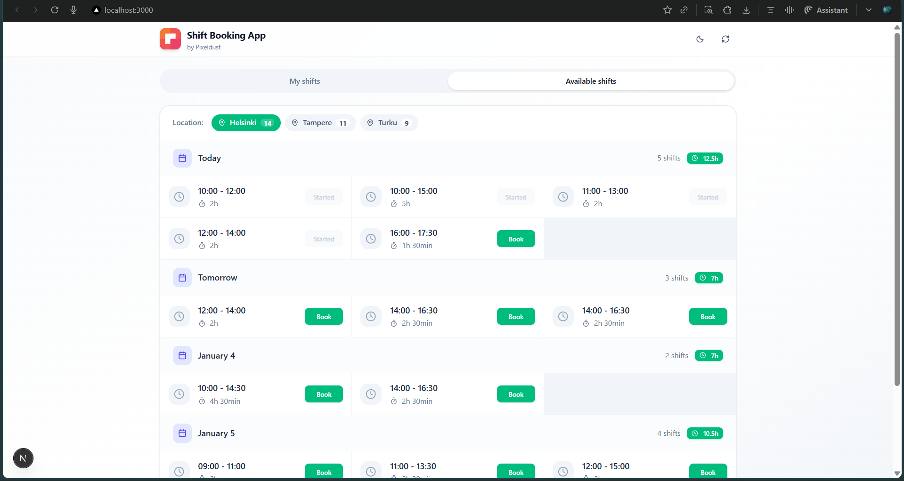
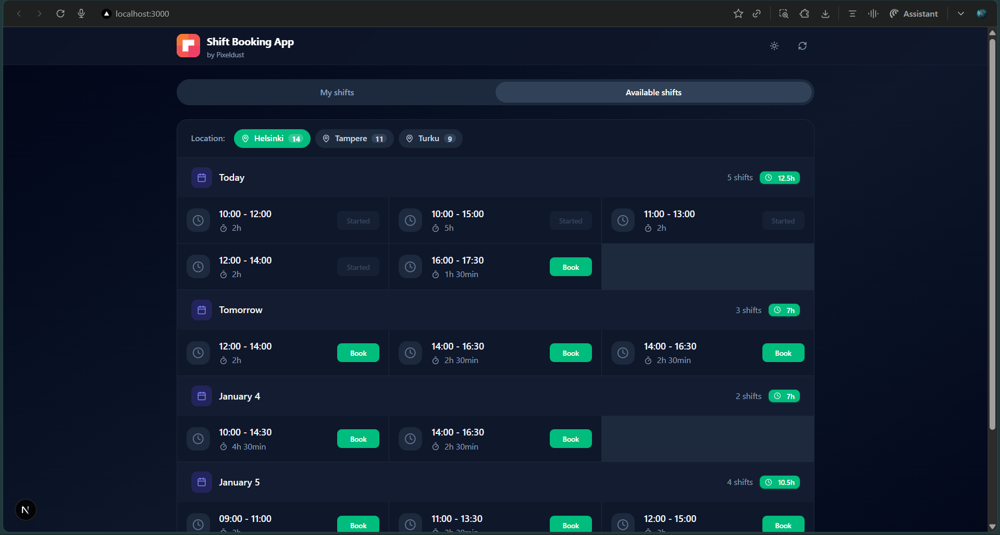
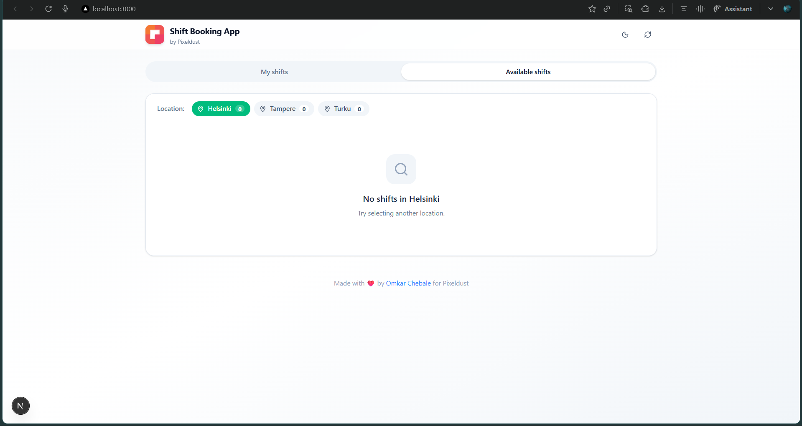
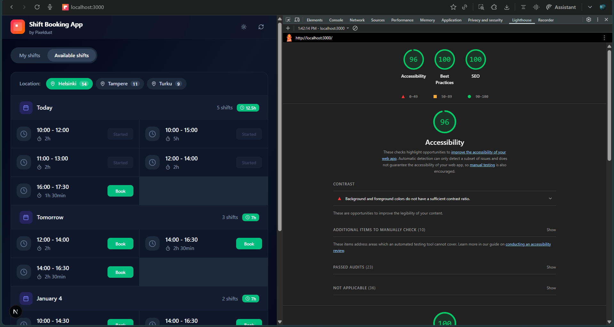

# Shift Booking App

A modern, responsive shift booking application built with Next.js 16, TypeScript, and Tailwind CSS.

## Screenshots

### Light Mode


### Dark Mode


### Error Handling


### Lighthouse Performance


## Features

### Core Functionality
- View available shifts organized by date with location filtering
- One-click booking with real-time status updates
- Easy cancellation of booked shifts
- Personal dashboard showing all booked shifts with total hours summary
- Filter shifts by Helsinki, Tampere, or Turku

### UI/UX
- Clean, modern design with smooth transitions
- Full dark mode support with system preference detection
- Responsive layout for mobile, tablet, and desktop
- Real-time feedback on all booking actions
- Skeleton loaders for better perceived performance
- User-friendly error messages

### Technical
- Full TypeScript implementation for type safety
- Zustand for efficient state management
- React.memo and useMemo for optimized rendering
- Next.js API proxy for seamless backend communication
- Comprehensive SEO metadata
- ARIA labels and semantic HTML for accessibility

## Getting Started

### Prerequisites
- Node.js 18+
- npm

### Installation

1. Clone the repository
```bash
git clone https://github.com/Chebaleomkar/pixeldust-frontend-hiring-assignment.git
cd pixeldust-frontend-hiring-assignment/solutions 
```

2. Install API dependencies (from root directory)
```bash
npm install
```

3. Install frontend dependencies (from solutions directory)
```bash
cd solutions
npm install
```

### Running the Application

You need to run both the API server and the Next.js frontend:

**Terminal 1 - API server** (from root directory):
```bash
npm start
```

**Terminal 2 - Frontend** (from solutions directory):
```bash
cd solutions
npm run dev
```

Open [http://localhost:3000](http://localhost:3000) in your browser.

### Environment Configuration

The frontend uses environment variables for configuration:

| Variable | Description | Default |
|----------|-------------|---------|
| `NEXT_PUBLIC_API_URL` | Backend API URL | `http://127.0.0.1:8080` |

**Local development** - No configuration needed (uses localhost fallback).

**Production/Staging** - Create `.env.production` or set in your CI/deployment:

```env
NEXT_PUBLIC_API_URL=https://api.your-domain.com
```


### Building for Production

```bash
cd solutions
npm run build
npm start
```

## Project Structure

```
solutions/
├── app/
│   ├── globals.css
│   ├── layout.tsx
│   └── page.tsx
├── src/
│   ├── assets/              # Screenshots and images
│   ├── components/
│   │   ├── shifts/
│   │   │   ├── CityFilter/
│   │   │   ├── ShiftCard/
│   │   │   └── ShiftGroup/
│   │   ├── views/
│   │   │   ├── MyShiftsView/
│   │   │   └── AvailableShiftsView/
│   │   └── ui/
│   ├── stores/
│   │   └── shiftStore.ts
│   ├── services/
│   │   └── api.ts
│   ├── types/
│   │   └── shift.ts
│   ├── utils/
│   │   ├── constants.ts
│   │   └── dateUtils.ts
│   └── lib/
│       └── utils.ts
├── public/
│   └── piexeldust.svg
└── next.config.ts
```

## Tech Stack

| Technology | Purpose |
|------------|---------|
| Next.js 16 | React framework with App Router |
| TypeScript | Type safety |
| Tailwind CSS | Utility-first styling |
| Zustand | State management |
| Axios | HTTP client |
| Lucide React | Icons |
| next-themes | Dark mode |
| Radix UI | Accessible primitives |

## API Endpoints

| Method | Endpoint | Description |
|--------|----------|-------------|
| GET | /shifts | List all shifts |
| GET | /shifts/:id | Get shift by ID |
| POST | /shifts/:id/book | Book a shift |
| POST | /shifts/:id/cancel | Cancel a shift |

## Performance Optimizations

- Dynamic imports for code splitting
- React.memo for preventing unnecessary re-renders
- useMemo for expensive computations
- Skeleton loaders for perceived performance
- Optimized font loading with `display: swap`
- Security headers for best practices

## Author

**Omkar Chebale**

Made with ❤️ for Pixeldust
